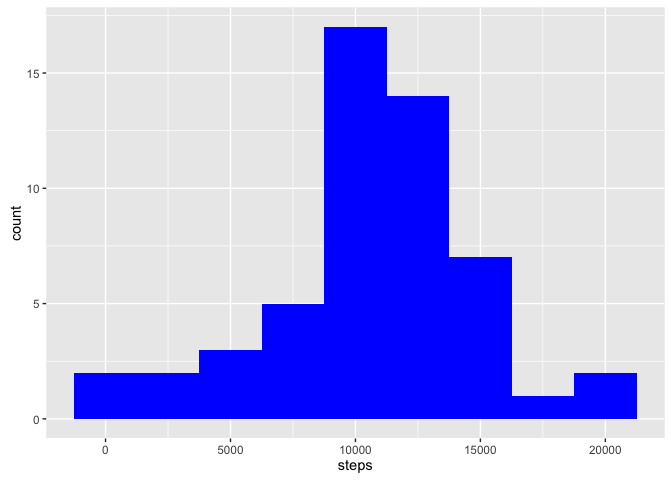
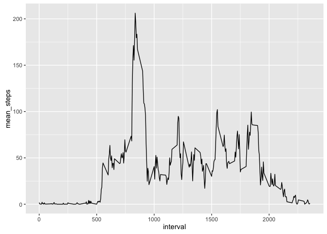
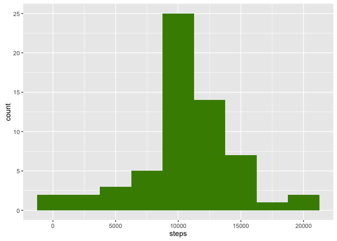
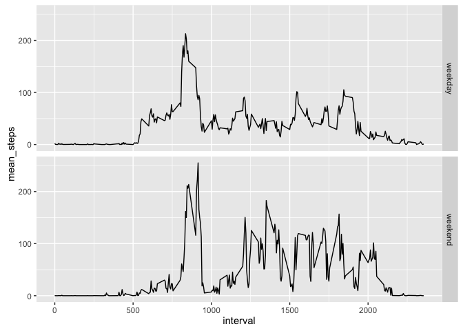

# Reproducible Research: Peer Assessment 1


## Loading and preprocessing the data

First we load the packages.


```r
library(dplyr)
```

```
## 
## Attaching package: 'dplyr'
```

```
## The following objects are masked from 'package:stats':
## 
##     filter, lag
```

```
## The following objects are masked from 'package:base':
## 
##     intersect, setdiff, setequal, union
```

```r
library(ggplot2)
library(data.table)
```

```
## 
## Attaching package: 'data.table'
```

```
## The following objects are masked from 'package:dplyr':
## 
##     between, last
```

Read in and convert from data.frame to data.table.

```r
activity <- read.csv("activity.csv")
activity <- data.table(activity)
```


## What is mean total number of steps taken per day?
1. Calculate the total number of steps taken per day
2. If you do not understand the difference between a histogram and a barplot, research the difference between them. Make a histogram of the total number of steps taken each day
3. Calculate and report the mean and median of the total number of steps taken per day


```r
stepDays <- activity %>% group_by(date) %>% summarise(total_steps = sum(steps))
stepDays <- data.table(stepDays)
ggplot(stepDays, aes(steps)) +
    geom_histogram(aes(total_steps), binwidth = 2500, fill = "blue")
```

```
## Warning: Removed 8 rows containing non-finite values (stat_bin).
```

<!-- -->

```r
# format is just to get it to print inline nicely.
step_mean <- format(mean(stepDays$total_steps, na.rm = TRUE), scientific = FALSE)
step_median <- median(stepDays$total_steps, na.rm = TRUE)
```
So the mean number of steps is 10766.19 and the medium number of steps is 10765.  For the histogram I chose binwidth of 2500 after some experimenting.

Note that eight lines omitted due to NA values for the histogram.


## What is the average daily activity pattern?


```r
stepPattern <- activity %>% group_by(interval) %>% summarize(mean_steps = mean(steps, na.rm = TRUE))
stepPattern <- data.table(stepPattern)
ggplot(stepPattern, aes(interval, mean_steps)) +
    geom_line(aes(interval, mean_steps))
```

<!-- -->

```r
max_interval <- filter(stepPattern, mean_steps == max(mean_steps))
```

So the max interval is at interval 835 and is  steps.


## Imputing missing values


```r
summary(activity)
```

```
##      steps                date          interval     
##  Min.   :  0.00   2012-10-01:  288   Min.   :   0.0  
##  1st Qu.:  0.00   2012-10-02:  288   1st Qu.: 588.8  
##  Median :  0.00   2012-10-03:  288   Median :1177.5  
##  Mean   : 37.38   2012-10-04:  288   Mean   :1177.5  
##  3rd Qu.: 12.00   2012-10-05:  288   3rd Qu.:1766.2  
##  Max.   :806.00   2012-10-06:  288   Max.   :2355.0  
##  NA's   :2304     (Other)   :15840
```

```r
# all NAs in column "steps".  So check only that.
na_steps <- is.na(activity$steps)
number_na_steps = sum(na_steps)
number_na_steps
```

```
## [1] 2304
```

All NAs are in the "steps" column so only need to count that column.  The number of rows with NA as steps value is 2304.

I am going to use the mean for that 5-minute interval to fill in NA.


```r
activity_imputed <- activity

for (val in 1:nrow(activity_imputed)) {
    if (is.na(activity_imputed[val,]$steps)) {
        activity_imputed[val,]$steps =  as.integer(round(filter(stepPattern, interval == activity_imputed[val,]$interval)$mean_steps))
    }
}
```

Now make histogram and find mean and medium for this imputed dataset.


```r
stepDays_i <- activity_imputed %>% group_by(date) %>% summarise(total_steps = sum(steps))
stepDays_i <- data.table(stepDays_i)
ggplot(stepDays_i, aes(steps)) +
    geom_histogram(aes(total_steps), binwidth = 2500, fill = "chartreuse4")
```

<!-- -->

```r
# format is just to get it to print inline nicely.
step_mean_i <- format(mean(stepDays_i$total_steps, na.rm = TRUE), scientific = FALSE)
step_median_i <- median(stepDays_i$total_steps, na.rm = TRUE)
```

So the mean number of steps with NAs imputed is 10765.64 compared to not imputed 10766.19.  The medium number of steps is 10762 compared to not imputed 10765.  Both of these are almost the same before imputing.  We are looking at total steps for each day and so just adding in a interval means for the NA did not change the histogram shape and mean and median much.

## Are there differences in activity patterns between weekdays and weekends?

First I will make a new column in the imputed data table of the weekday number.  Then from that add column indicating whether "weekend" or "weekday".  I then create data table grouped by interval and weekdayend and created mean steps column.  Then using ggplot with facet_grid created graph comparing weekdays with weekends.


```r
activity_imputed$daynum <- as.POSIXlt(activity_imputed$date)$wday
activity_imputed <- mutate(activity_imputed, weekdayend = ifelse(daynum == 6, "weekend", "weekday"))

stepPattern_i <- activity_imputed %>% group_by(interval, weekdayend) %>% summarize(mean_steps = mean(steps))

stepPattern_i <- data.table(stepPattern_i)

ggplot(stepPattern_i, aes(interval, mean_steps)) +
    geom_line() +
    facet_grid(weekdayend ~.)
```

<!-- -->

Looking at this graph, one can see there is some difference of activity patterns between weekdays and weekends.
